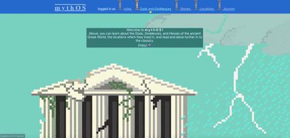

<h2>mythOS</h2>
<strong>Miles Marillo</strong>
 
mythOS was my final project during my Flatiron School immersive web developement bootcamp. 
uses React frontend, Rails API 
additional techs:
<ul>
  <li> -> d3 data visualization </li>
  <li> -> google maps api </li>
  <li> -> geolocation </li>
  <li> -> bCrypt/javascript web tokens for authorization </li>
</ul>
